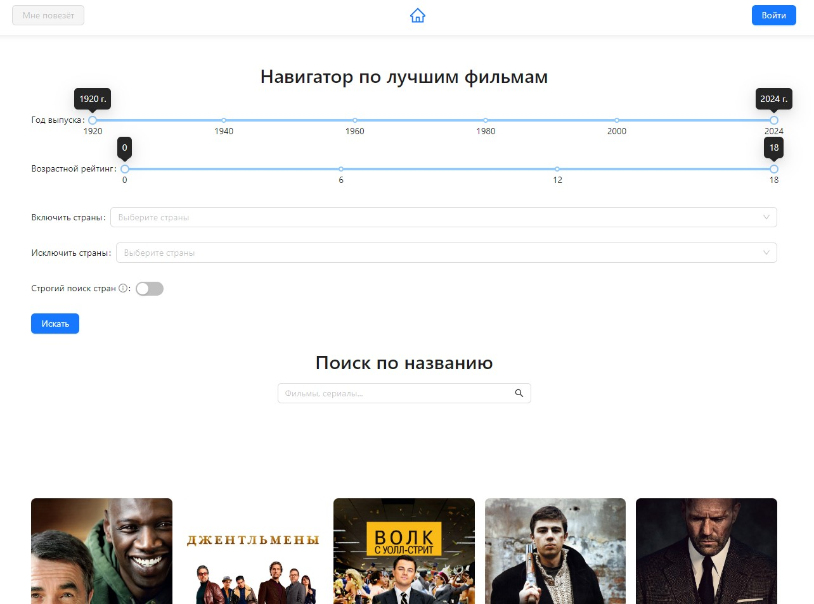
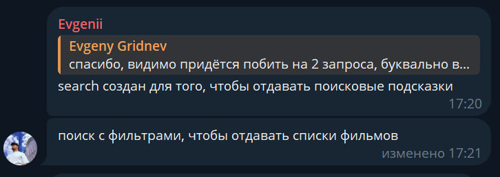

# Проект "Тестовое задание для стажёра Авито"

## Описание проекта

Разработать фронтенд приложение для быстрого поиска информации по фильмам и сериалам с платформы [API кинопоиска](https://api.kinopoisk.dev/documentation#/)

## Технологии

- **React**: Используется для создания пользовательского интерфейса.
- **TypeScript**: Для статической типизации и улучшения читаемости кода.
- **Docker**: Для упаковки приложения в контейнер для упрощения развертывания.
- **React-Router-Dom**: Позволяет управлять маршрутизацией в веб-приложениях на React.
- **Webpack**: Служит для сборки модулей JavaScript и подготовки ваших файлов к развертыванию.
- **Openapi-typescript**: Преобразует спецификации OpenAPI в TypeScript типы для типизированного взаимодействия с API.
- **Openapi-typescript-fetch**: Генерирует типизированные обертки для запросов к API на основе спецификации OpenAPI.
- **Eslint**: Инструмент для статической проверки кода на ошибки и принудительного соблюдения выбранного стиля кодирования.

## Приложение



## Установка и запуск

### Установка зависимостей (из директории репозитория)

```bash
npm ci
```

### Запуск проекта в режиме разработчика

```bash
TOKEN=<your api token> npm run start
```

## Развернуть Docker контейнер

### Сборка образа (из директории репозитория)

```bash
docker build -t moviepoisk .
```

### Запуска контейнера с токеном

```bash
docker run -e TOKEN=<your api token> -p 3000:3000 moviepoisk
```

### Авторизация

- **user**: user
- **password**: password

### Запросы к API кинопоиска

#### Все свои запросы к API я осуществлял через [openapi-typescript-fetch](https://www.npmjs.com/package/openapi-typescript-fetch), типы для которого я сгенерировал с помощью [openapi-typescript](https://www.npmjs.com/package/openapi-typescript) из [OpenAPI Specification (YAML)](https://api.kinopoisk.dev/documentation-yaml) с сайта [документации API](https://api.kinopoisk.dev/documentation#/)

Пример получившегося запроса:

[Фильтр фильмов: (год: с 1910 г. по 2024 г. , возраст: от 6 до 18 , страна: Австралия, но без Албании.). Выбранные поля: (year, id, name, poster, ageRating, shortDescription, countries) ](https://api.kinopoisk.dev/v1.4/movie?selectFields=year&selectFields=id&selectFields=name&selectFields=poster&selectFields=ageRating&selectFields=shortDescription&selectFields=countries&page=1&limit=10&year=1960-2024&ageRating=6-18&countries.name=%2B%D0%90%D0%B2%D1%81%D1%82%D1%80%D0%B8%D1%8F&countries.name=!%D0%90%D0%BB%D0%B1%D0%B0%D0%BD%D0%B8%D1%8F)

### Нюансы разработки

#### Проблема: В API отсутствует метод, который позволял совмещать поиск по названию и по фильтру.  
#### Поиск: Зашёл в телеграм чат, чтобы разобраться. Нашёл сообщения от создателя API:  


#### Решение: Реализовать поиск по фильтрам, а также поисковик по названиям, как отдельные компоненты.